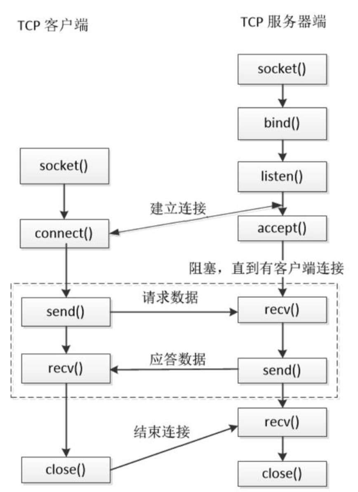

# Socket 网络编程
本项目用于学习windows平台下的socket网络通信，项目包含多个示例工程，从简单到复杂，逐步学习并实践socket通信的相关技术.

**环境:**  
- `Intel x64`
- `Windows 10`
- `Visual Studio Community 2017 (v141)`
- `CMake 3.18.5`
- `winsock2`

# Socket 简介
> 80年代初，美国政府的高级研究工程机构（ARPA）给加利福尼亚大学Berkeley分校提供了资金，让他们在UNIX操作系统下实现TCP/IP协议。在这个项目中，研究人员为TCP/IP网络通信开发了一个API（应用程序接口）。这个API称为Socket接口（套接字）。今天，SOCKET接口是TCP/IP网络最为通用的API，也是在INTERNET上进行应用开发最为通用的API。
> 90年代初，由Microsoft联合了其他几家公司共同制定了一套WINDOWS下的网络编程接口，即WindowsSockets规范。它是BerkeleySockets的重要扩充，主要是增加了一些异步函数，并增加了符合Windows消息驱动特性的网络事件异步选择机制。WindowsSockets规范是一套开放的、支持多种协议的Windows下的网络编程接口。从1991年的1.0版到1995年的2.0.8版，经过不断完善并在Intel、Microsoft、Sun、SGI、Informix、Novell等公司的全力支持下，已成为Windows网络编程的事实上的标准。目前，在实际应用中的WindowsSockets规范主要有1.1版和2.0版。两者的最重要区别是1.1版只支持TCP/IP协议，而2.0版可以支持多协议。2.0版有良好的向后兼容性，任何使用1.1版的源代码，二进制文件，应用程序都可以不加修改地在2.0规范下使用。
> SOCKET实际在计算机中提供了一个通信端口，可以通过这个端口与任何一个具有SOCKET接口的计算机通信。应用程序在网络上传输，接收的信息都通过这个SOCKET接口来实现。在应用开发中就像使用文件句柄一样，可以对SOCKET句柄进行读，写操作。


# IP地址（IP Address）
计算机分布在世界各地，要想和它们通信，必须要知道确切的位置。确定计算机位置的方式有多种，IP 地址是最常用的，例如，`114.114.114.114` 是国内第一个、全球第三个开放的 DNS 服务地址，`127.0.0.1` 是本地回环，`0.0.0.0`表示整个网络.

```md
在socket通信的服务器端有时会将监听的IP地址设置为`INADDR_ANY`, 该宏定义为`0.0.0.0`,在这里泛指本机的意思，也就是表示本机的所有IP.
因为有些机子不止一块网卡，多网卡的情况下，这个就表示所有网卡ip地址的意思。
比如一台电脑有3块网卡，分别连接三个网络，那么这台电脑就有3个ip地址了，如果某个应用程序需要监听某个端口，那应该监听哪个网卡地址的端口呢？
如果绑定某个具体的ip地址，那么只能监听所设置的ip地址所在的网卡的端口，其它两块网卡无法监听端口; 如果需要三个网卡都监听，那就需要绑定3个ip，也就等于需要管理3个套接字进行数据交换，过于繁琐.
所以出现`INADDR_ANY`，只需绑定INADDR_ANY，管理一个套接字就行，不管数据是从哪个网卡过来的，只要是绑定的端口号过来的数据，都可以接收到。

假设我们在一台机器上开发一个服务器程序，则使用bind函数时，我们有多个IP地址可以选择。  
首先，这台机器的公网IP地址是120.55.94.78，在当前局域网中的地址是192.168.1.104。同时，这台机器有本地回环地址127.0.0.1。  
如果只想在本机上进行访问，那么对 bind 函数中的地址可以使用 127.0.0.1；  
如果服务只想被局域网中的内部机器访问，那么bind函数中的地址可以使用192.168.1.104这样的局域网地址；  
如果希望这个服务可以被公网访问，那么可以使用公网IP地址是120.55.94.78；  
如果这个公网IP地址是由运营商动态分配的，过一段时间可能服务器端IP地址发生了改变，这时如果不希望修改服务器端代码，那么对 bind 函数中的地址可以使用地址 0.0.0.0 或INADDR_ANY。
```

其实，我们的计算机并不知道 IP 地址对应的地理位置，当要通信时，只是将 IP 地址封装到要发送的数据包中，交给路由器去处理。路由器有非常智能和高效的算法，很快就会找到目标计算机，并将数据包传递给它，完成一次单向通信。

目前大部分软件使用 IPv4 地址，但 IPv6 也正在被人们接受，尤其是在教育网中，已经大量使用。

# 端口（Port）
有了 IP 地址，虽然可以找到目标计算机，但仍然不能进行通信。一台计算机可以同时提供多种网络服务，例如Web服务、FTP服务（文件传输服务）、SMTP服务（邮箱服务）等，仅有 IP 地址，计算机虽然可以正确接收到数据包，但是却不知道要将数据包交给哪个网络程序来处理，所以通信失败。

为了区分不同的网络程序，计算机会为每个网络程序分配一个独一无二的端口号（Port Number），例如:  
- Web服务: 80
- FTP服务: 21
- SMTP服务: 25

端口（Port）是一个虚拟的、逻辑上的概念。可以将端口理解为一道门，数据通过这道门流入流出，每道门有不同的编号，就是端口号。

# 协议（Protocol）
协议（Protocol）就是网络通信的约定，通信的双方必须都遵守才能正常收发数据。协议有很多种，例如 TCP、UDP、IP 等，通信的双方必须使用同一协议才能通信。协议是一种规范，由计算机组织制定，规定了很多细节，例如，如何建立连接，如何相互识别等。
> 协议仅仅是一种规范，必须由计算机软件来实现。例如 IP 协议规定了如何找到目标计算机，那么各个开发商在开发自己的软件时就必须遵守该协议，不能另起炉灶。

所谓协议族（Protocol Family），就是一组协议（多个协议）的统称。最常用的是 TCP/IP 协议族，它包含了 TCP、IP、UDP、Telnet、FTP、SMTP 等上百个互为关联的协议，由于 TCP、IP 是两种常用的底层协议，所以把它们统称为 TCP/IP 协议族。 


# 数据传输方式
计算机之间有很多数据传输方式，各有优缺点，常用的有两种：SOCK_STREAM 和 SOCK_DGRAM。

1. SOCK_STREAM 表示面向连接的数据传输方式。数据可以准确无误地到达另一台计算机，如果损坏或丢失，可以重新发送，但效率相对较慢。常见的 http 协议就使用 SOCK_STREAM 传输数据，因为要确保数据的正确性，否则网页不能正常解析。

2. SOCK_DGRAM 表示无连接的数据传输方式。计算机只管传输数据，不作数据校验，如果数据在传输中损坏，或者没有到达另一台计算机，是没有办法补救的。也就是说，数据错了就错了，无法重传。因为 SOCK_DGRAM 所做的校验工作少，所以效率比 SOCK_STREAM 高。

QQ 视频聊天和语音聊天就使用 SOCK_DGRAM 传输数据，因为首先要保证通信的效率，尽量减小延迟，而数据的正确性是次要的，即使丢失很小的一部分数据，视频和音频也可以正常解析，最多出现噪点或杂音，不会对通信质量有实质的影响。

> 注意：SOCK_DGRAM 没有想象中的糟糕，不会频繁的丢失数据，数据错误只是小概率事件。

有可能多种协议使用同一种数据传输方式，所以在 socket 编程中，需要同时指明`数据传输方式`和`协议`。


综上所述：`IP地址`和`端口`能够在广袤的互联网中定位到要通信的程序，`协议`和`数据传输方式`规定了如何传输数据，有了这些，两台计算机就可以通信了。

# TCP网络通信的基本流程
服务器和客户端程序的网络通信基本原理如下所述:  

- 服务器

1. 调用socket函数创建`监听socket`;
2. 调用bind函数将socket绑定到某个IP和端口的二元组上(`ip:port`);
3. 调用listen函数开启监听;
4. 当有客户端请求连接上来时,调用accept函数接受连接,产生一个新的socket(`客户端socket`);
5. 基于新产生的`客户端socket`调用send或recv函数,开始与客户端进行数据交流;
6. 与当前客户端的通信结束后,调用shutdown关闭通信, 调用close/closesocket函数关闭`客户端socket`;
7. 服务结束，且不再准备接受新的客户端连接时，调用close/closesocket函数关闭`监听socket`.

- 客户端

1. 调用socket函数创建`客户端socket`;
2. 调用connect函数尝试连接服务器;
3. 连接成功后调用send或recv函数,开始与服务器进行数据交流;
4. 通信结束后,调用shutdown关闭通信,调用close/closesocket函数关闭`客户端socket`.

<div align="center">

</div>


# Windows SDK
> 微软每推出一个重要的windows版本，一般都会同时推出一个SDK（Software Development Kit）。SDK包含了开发该windows版本所需的windows函数和常数定义、API函数说明文档、相关工具和示例。SDK一般使用C语言，但不包括编译器。

在安装`Visual Studio`时一般同时安装了windows sdk, 例如`Windows 10 SDK (10.0.17763.0)`, `Windows 8.1 SDK`等.

`Windows SDK`中包含了两个版本的socket网络通信库: [winsock](https://docs.microsoft.com/en-us/windows/win32/api/winsock/)和[winsock2](https://docs.microsoft.com/en-us/windows/win32/api/winsock2/)

相关头文件和库函数分别包括:  
- winsock
    - `winsock.h`
    - `Windows.h`
- winsock2
    - `WinSock2.h`
    - `Windows.h`
    - `ws2_32.dll`
    - `WS2_32.Lib`

# 项目例程
- [winsock2编程相关配置](doc/winsock2_program.md)
- [基础TCP/IP通信例程](doc/basic_tcp.md)
- [封装TCP/IP通信代码](doc/socket_class_raii.md)
<!-- - [非阻塞的TCP/IP客户端](doc/non_block_tcp.md) -->

# 参考教程
- [Overview of the Windows Sockets 2 technology - docs.microsoft](https://docs.microsoft.com/en-us/windows/win32/api/_winsock/)
- [Asio C++ Library : 用于网络和底层I/O编程的跨平台的C++库](https://think-async.com/Asio/)
- [C/C++ socket编程教程 - C语言中文网](http://c.biancheng.net/cpp/socket/)
- [Socket编程指南及示例程序](http://www.blogjava.net/wxb_nudt/archive/2007/11/01/157623.html)
- [C++服务器开发精髓 - 张远龙](https://gitee.com/balloonwj/mybooksources)

